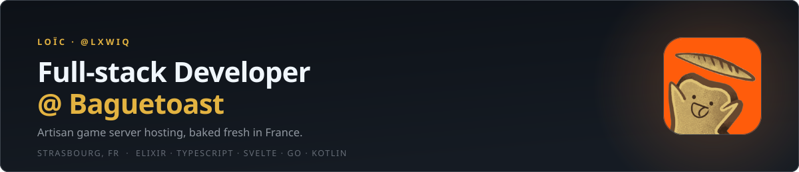
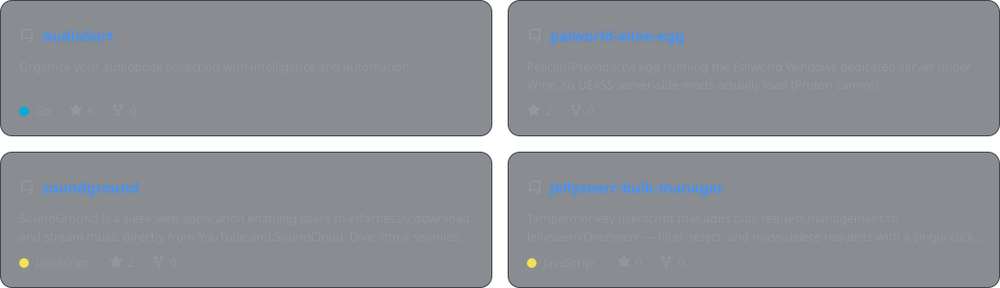
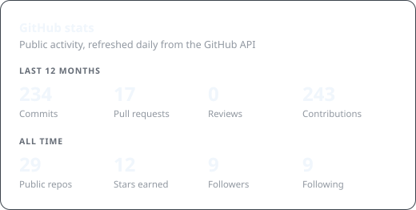
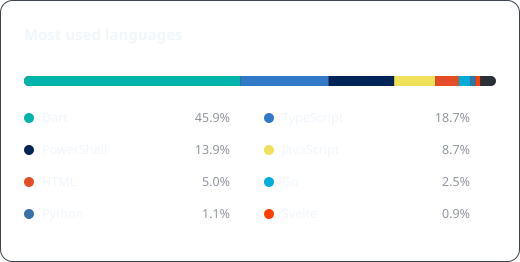
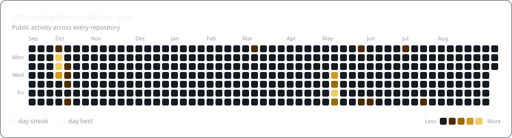

<div align="center">

<picture>
  <source media="(prefers-color-scheme: dark)" srcset="./assets/header-dark.svg">
  <source media="(prefers-color-scheme: light)" srcset="./assets/header-light.svg">
  
</picture>

<br>

[](https://baguetoast.com)
[](mailto:loic.aviez91@gmail.com)
[](https://github.com/lxwiq)


</div>

---

## 🥖 About me

I'm **Loïc**, a full-stack developer based in **Strasbourg, France**.

By day I build **[Baguetoast](https://github.com/Baguetoast)** — *artisan game server hosting, baked fresh in France* — from the Elixir control plane down to the bare-metal nodes. By night I write self-hosting tools I actually want to use: a Jellyfin client, an audiobook organiser, a few game-server eggs nobody else felt like maintaining.

```elixir
%Developer{
  name:     "Loïc",
  handle:   "@lxwiq",
  role:     "Full-stack Developer @ Baguetoast",
  location: "Strasbourg, France 🇫🇷",
  daily:    ["Elixir", "TypeScript", "Svelte", "Go", "Kotlin"],
  hobby:    ["self-hosting", "homelab", "game-server ops"],
  fuel:     :coffee_and_toast
}
```

- 🔭 Currently shipping the new **Baguetoast dashboard** (TanStack Start + shadcn/ui) and our **Pelican Wings** orchestration layer
- 🌱 Going deeper on **Elixir / OTP** and **Kotlin Multiplatform**
- 🧰 I like **boring infrastructure** and **fast frontends**
- 💬 Ask me about Elixir/Phoenix, Svelte, self-hosting or running game servers at scale
- ⚡ Fun fact: I once shipped a Wine-based Palworld egg just so server-side mods would finally load

---

## 🍞 What I'm baking at Baguetoast

> **[Baguetoast](https://baguetoast.com)** — Artisan game server hosting, baked fresh in France. 🥖
> Deploy a game server in a couple of clicks, no ops degree required.

| Layer | What I work on | Stack |
| :-- | :-- | :-- |
| 🧠 **Control plane** | Server lifecycle, billing, provisioning over Pelican Wings | `Elixir` `Phoenix` `PostgreSQL` |
| 🖥️ **Web & dashboard** | Marketing site, customer dashboard, live server console | `SvelteKit` `TanStack Start` `Tailwind` `shadcn/ui` |
| 🤖 **Automation** | Discord bots that pilot game servers straight from a guild | `TypeScript` `Discord.js` |
| 📚 **Docs** | `wiki.baguetoast.com`, written so support tickets never happen | `Astro Starlight` `MDX` |
| ⚙️ **Infra** | Node deployment, Wings orchestration, monitoring, ops scripts | `Docker` `Linux` `Shell` `Cloudflare` |

---

## 🧰 Tech stack

**Languages**


**Frontend**


**Backend & data**


**Mobile & multiplatform**


**Ops & tooling**


---

## 🧑‍🍳 Featured projects

<div align="center">

<picture>
  <source media="(prefers-color-scheme: dark)" srcset="./assets/projects-dark.svg">
  <source media="(prefers-color-scheme: light)" srcset="./assets/projects-light.svg">
  
</picture>

</div>

<details>
<summary><b>🗂️ More things I've built</b></summary>

<br>

| Project | What it does | Stack |
| :-- | :-- | :-- |
| [**JellyFish**](https://github.com/lxwiq/JellyFish) | Modern cross-platform Jellyfin client | `Kotlin Multiplatform` `Compose` |
| [**AudioSort**](https://github.com/lxwiq/AudioSort) | Organises audiobook collections with intelligence and automation | `Go` |
| [**palworld-wine-egg**](https://github.com/lxwiq/palworld-wine-egg) | Pelican/Pterodactyl egg running Palworld's Windows server under Wine, so UE4SS mods actually load | `Shell` `Wine` |
| [**soundground**](https://github.com/lxwiq/soundground) | Search, stream and download music from YouTube & SoundCloud | `JavaScript` |
| [**jellyseerr-bulk-manager**](https://github.com/lxwiq/jellyseerr-bulk-manager) | Userscript adding bulk request management to Jellyseerr/Overseerr | `JavaScript` `Tampermonkey` |
| [**ktc-edit**](https://github.com/lxwiq/ktc-edit) | Kingdom Two Crowns save editor, in the browser | `Svelte` |
| [**pesdst**](https://github.com/lxwiq/pesdst) | Converts embroidery `.PES` files to `.DST` | `JavaScript` |
| [**dotfiles**](https://github.com/lxwiq/dotfiles) | My WSL / macOS / Linux setup, Neovim included | `Lua` `Shell` |

</details>

---

## 📊 Stats & activity

<div align="center">

<picture>
  <source media="(prefers-color-scheme: dark)" srcset="./assets/stats-dark.svg">
  <source media="(prefers-color-scheme: light)" srcset="./assets/stats-light.svg">
  
</picture>
<picture>
  <source media="(prefers-color-scheme: dark)" srcset="./assets/langs-dark.svg">
  <source media="(prefers-color-scheme: light)" srcset="./assets/langs-light.svg">
  
</picture>

<br><br>

<picture>
  <source media="(prefers-color-scheme: dark)" srcset="./assets/calendar-dark.svg">
  <source media="(prefers-color-scheme: light)" srcset="./assets/calendar-light.svg">
  
</picture>

<sub>Cards are generated straight from the GitHub API by <a href="./scripts/generate-cards.mjs"><code>scripts/generate-cards.mjs</code></a> and refreshed daily by <a href="./.github/workflows/cards.yml">a workflow</a> — no third-party stats service involved.</sub>

</div>

---

## 🐍 Contribution snake

<div align="center">

<picture>
  <source media="(prefers-color-scheme: dark)" srcset="https://raw.githubusercontent.com/lxwiq/lxwiq/output/snake-dark.svg">
  <source media="(prefers-color-scheme: light)" srcset="https://raw.githubusercontent.com/lxwiq/lxwiq/output/snake-light.svg">
  
</picture>

</div>

---

## 🤝 Let's talk

<div align="center">

Got a game server idea, an Elixir question, or just want to say hi? My inbox is always warm.

[](https://baguetoast.com)
[](https://github.com/lxwiq)
[](mailto:loic.aviez91@gmail.com)

<br>

<sub><i>Built with Elixir, Svelte and an unreasonable amount of bread puns.</i> 🥖</sub>

</div>
